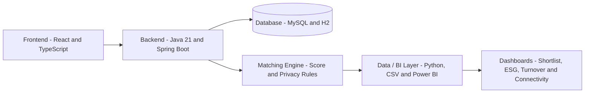

# App BiT

App BiT helps companies create fairer, privacy-conscious and data-driven hiring shortlists by combining candidate matching, anonymized screening and business intelligence analysis.


## Overview

App BiT is an intelligent recruiting MVP designed to support objective, inclusive and privacy-first hiring decisions.

The platform generates candidate shortlists based on job requirements, calculates match scores, protects sensitive candidate information during the first screening stage and supports decision-making with regional connectivity analysis and BI indicators such as Turnover, ESG and Team Health.

## MVP Results

- 8 official demo candidates validated.
- Candidate shortlist generated with match score.
- Sensitive candidate data protected during first screening.
- Contact information released only after explicit approval.
- BI-ready datasets prepared for Power BI analysis.
- Backend, frontend and Data / BI layer integrated into main.
- Full MVP CI validated with Backend, Frontend and Data / BI jobs.
- MVP version published as v1.0.0-mvp.

## Product Preview

Product screenshots will be added as the team consolidates the final visual flow.

Planned preview items:

- Candidate shortlist screen
- Anonymized candidate view
- Approval flow for contact release
- BI / Power BI indicators view

## Key Features

- Candidate matching based on job requirements and profile attributes.
- Privacy-first screening with anonymized candidate data.
- Sensitive contact release only after explicit approval.
- Bias-aware shortlist flow to reduce exposure of unnecessary personal data.
- Regional connectivity insights to support inclusive hiring decisions.
- BI-ready datasets for Power BI dashboards.
- Turnover, ESG and Team Health indicators for business analysis.
- Validation scripts to keep score, shortlist and BI outputs consistent.

## Architecture



Simplified flow:

```text
Frontend -> Backend API -> Matching and Privacy Rules -> Data / BI Outputs -> Dashboards
```

## Tech Stack

### Backend

- Java 21
- Spring Boot
- Maven
- Flyway
- H2
- MySQL
- JWT

### Frontend

- React
- TypeScript
- Vite
- Axios

### Data / BI

- Python
- Power BI
- DAX
- CSV
- Pytest

## Project Structure

```text
backend/    Backend API, business rules, authentication and migrations
frontend/   Web interface and backend integration
data/       Processed datasets for BI and dashboards
docs/       Technical and analytical documentation
scripts/    Data generation, validation and integration scripts
tests/      Score, anonymization and regression tests
```

## How to Run

### Backend

Requirements:

- Java 21
- Maven Wrapper
- MySQL for local database execution

```bash
cd backend
./mvnw test
./mvnw spring-boot:run
```

On Windows:

```powershell
cd backend
.\mvnw.cmd test
.\mvnw.cmd spring-boot:run
```

### Frontend

Requirements:

- Node.js
- npm

```bash
npm install
npm run dev
```

Build:

```bash
npm run build
```

### Data / BI

Requirements:

- Python
- Pytest

```bash
python -m pytest tests/test_score_match.py tests/test_score_regression.py tests/test_anonymization.py -q
python scripts/valida_integracao_bi.py
```

Generate the MVP shortlist:

```bash
python -m scripts.gera_shortlist_mvp
```

## Environment Variables

```env
DB_HOST_APPBIT=localhost
DB_PORT_APPBIT=3306
DB_NAME_APPBIT=appbit
DB_USER_APPBIT=root
DB_PASSWORD_APPBIT=your_password
JWT_SECRET=your_secure_secret_key
JWT_EXPIRATION_MS=86400000
VITE_API_URL=http://localhost:8080
```

## Documentation

Additional project documentation is available in the `docs/` directory, including:

- Match score calculation
- Power BI support
- Data storytelling
- BI validation
- Candidate anonymization flow
- Backend and frontend integration notes

## Team Project and My Contribution

App BiT was developed as a team project during the No Country simulation program.

My main contribution was focused on the Data / BI layer and integration alignment, including:

- structuring the official MVP candidate dataset;
- validating the 8-candidate shortlist;
- supporting the score_match logic;
- preparing BI-ready files for Power BI;
- documenting the data storytelling;
- validating anonymization rules;
- supporting frontend/backend integration alignment.

Additional contribution details can be expanded by each team member in AUTHORS.md or future documentation updates.

## Status

MVP — locally validated.

## Authors and Contributors

This project was developed by the App BiT team during the No Country simulation program.

See [AUTHORS.md](AUTHORS.md) for contributor details.

## License

This project is licensed under the MIT License.

See [LICENSE](LICENSE) for details.
