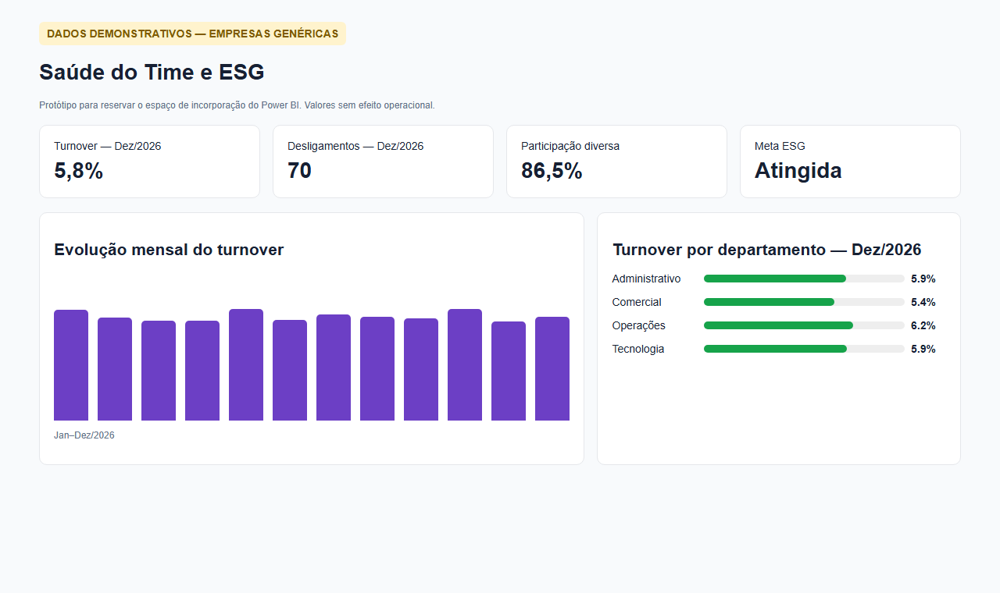
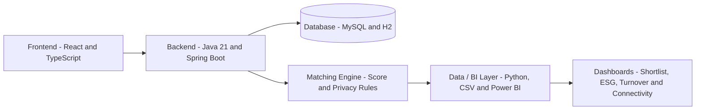

# App BiT

App BiT helps companies create fairer, privacy-conscious and data-driven hiring shortlists by combining candidate matching, anonymized screening and business intelligence analysis.


[](docs/power-bi-dashboard-tela-2.md)
[](LICENSE)
[](https://github.com/No-Country-simulation/S06-26-AB-Equipe_23/actions/workflows/full-mvp-ci.yml)

## Overview

App BiT is an intelligent recruiting MVP designed to support objective, inclusive and privacy-first hiring decisions.

The platform generates candidate shortlists based on job requirements, calculates match scores, protects sensitive candidate information during the first screening stage and supports decision-making with regional connectivity analysis and BI indicators such as Turnover, ESG and Team Health.

## Deploy Links (Live Demo)

- **Frontend Application (Web):** [https://appbit-frontend.onrender.com](https://appbit-frontend.onrender.com)
- **Backend API Health:** [https://appbit-backend-0v3u.onrender.com/actuator/health](https://appbit-backend-0v3u.onrender.com/actuator/health)

## MVP Results

- 8 official demo candidates validated.
- Candidate shortlist generated with match score.
- Sensitive candidate data protected during first screening.
- Contact information released only after explicit approval.
- BI-ready datasets prepared for Power BI analysis.
- Backend, frontend and Data / BI layer integrated into main.
- Full MVP CI validated with Backend, Frontend and Data / BI jobs.
- MVP version published as v1.0.0-mvp.

## Product Preview

The BI preview below uses the demonstrative company metrics dataset prepared for the MVP. It represents the dashboard structure for Turnover, ESG and Team Health analysis and is not a live embedded Power BI report.



Related BI assets:

- `data/powerbi/shortlist_candidatos_powerbi.csv`
- `data/powerbi/insights_regioes_powerbi.csv`
- `data/powerbi/metricas_empresa_demo.csv`
- `exports/mock_dashboard_metricas_empresa.html`

## Key Features

- Candidate matching based on job requirements and profile attributes.
- Privacy-first screening with anonymized candidate data.
- Sensitive contact release only after explicit approval.
- Bias-aware shortlist flow to reduce exposure of unnecessary personal data.
- Regional connectivity insights to support inclusive hiring decisions.
- BI-ready datasets for Power BI dashboards.
- Turnover, ESG and Team Health indicators for business analysis.
- Validation scripts to keep score, shortlist and BI outputs consistent.

## Architecture



Simplified flow:

```text
Frontend -> Backend API -> Matching and Privacy Rules -> Data / BI Outputs -> Dashboards
```

## Tech Stack

### Backend

- Java 21
- Spring Boot
- Maven
- Flyway
- H2
- MySQL
- JWT

### Frontend

- React
- TypeScript
- Vite
- Axios

### Data / BI

- Python
- Power BI
- DAX
- CSV
- Pytest

## Project Structure

```text
backend/      Backend API, business rules, authentication and migrations
frontend/     Web interface and backend integration
data/         Processed datasets for BI and dashboards
docs/         Technical and analytical documentation
scripts/      Data generation, validation and integration scripts
tests/        Score, anonymization and regression tests
```

## How to Run

### Prerequisites

| Tool | Version | Purpose |
|---|---|---|
| Java | 21 | Backend |
| Maven Wrapper | included | Build backend |
| MySQL | 8+ | Database |
| Node.js | 18+ | Frontend |
| npm | 9+ | Frontend dependencies |
| Python | 3.10+ | Data / BI validation |

---

### Step 1 — Create the database

Open MySQL Workbench or a MySQL terminal and run:

```sql
CREATE DATABASE IF NOT EXISTS appbit
  CHARACTER SET utf8mb4
  COLLATE utf8mb4_unicode_ci;
```

---

### Step 2 — Configure backend environment

Copy the example file and fill in your MySQL credentials:

```bash
cp backend/env.example backend/.env
```

Edit `backend/.env`:

```env
DB_HOST_APPBIT=localhost
DB_PORT_APPBIT=3306
DB_NAME_APPBIT=appbit
DB_USER_APPBIT=root
DB_PASSWORD_APPBIT=your_mysql_password
JWT_SECRET=97c4e511488e02bf17dbec1451d0879e64e526487e411ea3ad858db4d94cd2f3
JWT_EXPIRATION_MS=86400000
APP_CORS_ALLOWED_ORIGINS=http://localhost:5173,http://localhost:4173
```

> Note: Spring Boot reads these as system environment variables, not directly from `.env`.
> On Windows, set them in the current terminal session before running:
>
> ```powershell
> $env:DB_PASSWORD_APPBIT="your_mysql_password"
> ```
>
> Or configure them in your IDE run configuration.
> The defaults hardcoded in `application.yaml` are used if the variables are not set.

---

### Step 3 — Run the backend

Open a terminal in the `backend/` folder:

```bash
# Linux / macOS
./mvnw spring-boot:run

# Windows
.\mvnw.cmd spring-boot:run
```

On first run, Flyway applies all migrations automatically (V1 to V5).
This creates all tables and seeds the demo data — candidates, regions, training tracks, events and mentors.

Expected output when ready:

```
Successfully applied 5 migrations to schema "appbit"
Tomcat started on port 8080
Started AppbitApplication in X seconds
```

The API is now available at `http://localhost:8080`.

Demo credentials:

```
email:  recrutador@appbit.com.br
senha:  Recrutador@Bit2026!
```

---

### Step 4 — Run the frontend

Open a **second terminal** at the project root (where `package.json` is):

```bash
npm install   # only needed on first run
npm run dev
```

The frontend starts at `http://localhost:5173` and connects to the backend at `http://localhost:8080`.

---

### Step 5 — Validate the data layer (optional)

```bash
python scripts/valida_integracao_bi.py
```

Expected output:

```
OK: candidatos=8, privacidade preservada
OK: antenas=132, regioes=24, sessoes e concentracao reconciliadas
OK: metricas empresariais demonstrativas=1152, segmentos=8
OK: servicos_mvp formacoes=6, eventos=24, mentorias=10
OK: locais de eventos mapeados para 24 regioes validas
OK: artefatos artificiais de candidatos ausentes
```

---

### Quick reference — two terminals

| Terminal | Folder | Command |
|---|---|---|
| 1 — Backend | `backend/` | `.\mvnw.cmd spring-boot:run` |
| 2 — Frontend | project root | `npm run dev` |

---

### Run backend tests

```bash
# All tests
.\mvnw.cmd test

# Matching logic only
.\mvnw.cmd test -Dtest=MatchingServiceTest

# Migration counts (V5 seed data)
.\mvnw.cmd test -Dtest=MigrationV5CountsTest
```

## Environment Variables

```env
DB_HOST_APPBIT=localhost
DB_PORT_APPBIT=3306
DB_NAME_APPBIT=appbit
DB_USER_APPBIT=root
DB_PASSWORD_APPBIT=your_password
JWT_SECRET=your_secure_secret_key
JWT_EXPIRATION_MS=86400000
VITE_API_URL=http://localhost:8080
```

## Documentation

Additional project documentation is available in the docs/ directory, including:

- Match score calculation
- Power BI support
- Data storytelling
- BI validation
- Candidate anonymization flow
- Backend and frontend integration notes

## Team Project and Contributions

App BiT was developed as a team project during the No Country simulation program.

| Contributor | Focus | Contribution |
| --- | --- | --- |
| Pedro Paullo Azevedo | Data / BI and integration support | Structured BI-ready datasets, validated the 8-candidate shortlist, supported score_match validation, documented data storytelling, prepared dashboard assets and checked anonymization rules. |
| Alessandra Heiser | Project management | Organized delivery priorities, aligned requirements with the team and supported sprint coordination for the MVP presentation. |
| Andre Ribeiro | Data analysis | Audited the score_match logic, validated error scenarios, supported regression tests and documented how the matching algorithm behaves. |
| Julio Noronha | Backend development | Built and stabilized backend services, authentication, database integration, migrations and backend CI validation. |

See [AUTHORS.md](AUTHORS.md) for contributor details.

## Status

MVP - locally validated.

## Authors and Contributors

This project was developed by the App BiT team during the No Country simulation program.

See [AUTHORS.md](AUTHORS.md) for contributor details.

## License

This project is licensed under the MIT License.

See [LICENSE](LICENSE) for details.
