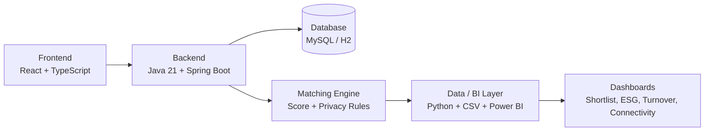

# App BiT

App BiT helps companies build fairer and more data-driven hiring shortlists by combining candidate matching, privacy-first screening, diversity awareness, and business intelligence insights.


## Overview

App BiT is an intelligent recruitment platform designed to support objective and privacy-conscious hiring decisions.

The platform generates candidate shortlists based on job requirements, calculates a match score, protects sensitive candidate information during the first screening stage, and supports decision-making through regional connectivity analysis and BI indicators such as Turnover, ESG, and Team Health.

## Key Features

- Privacy-first candidate shortlisting.
- Match score calculation between candidates and job openings.
- Bias-aware screening flow with anonymized candidate data.
- Contact information release only after explicit approval.
- Regional connectivity insights to support inclusive hiring decisions.
- BI-ready datasets for Power BI dashboards.
- Turnover, ESG, and Team Health indicators for business analysis.
- Data validation scripts to keep candidate and BI outputs consistent.

## Architecture



Simplified flow:

```text
Frontend -> Backend API -> Matching & Privacy Rules -> Data/BI Outputs -> Dashboards
```

## Tech Stack

### Backend

- Java 21
- Spring Boot
- Maven
- Flyway
- H2
- MySQL
- JWT

### Frontend

- React
- TypeScript
- Vite
- Axios

### Data / BI

- Python
- Power BI
- DAX
- CSV
- Pytest

## Project Structure

```text
backend/    Backend API, business rules, authentication and migrations
frontend/   Web interface and backend integration
data/       Processed datasets for BI and dashboards
docs/       Technical and analytical documentation
scripts/    Data generation, validation and integration scripts
tests/      Score, anonymization and regression tests
```

## How to Run

### Backend

Requirements:

- Java 21
- Maven Wrapper
- MySQL for local database execution

```bash
cd backend
./mvnw test
./mvnw spring-boot:run
```

On Windows:

```powershell
cd backend
.\mvnw.cmd test
.\mvnw.cmd spring-boot:run
```

### Frontend

Requirements:

- Node.js
- npm

```bash
cd frontend
npm install
npm run dev
```

Build:

```bash
npm run build
```

### Data / BI

Requirements:

- Python
- Pytest

```bash
python -m pytest tests/test_score_match.py tests/test_score_regression.py tests/test_anonymization.py -q
python scripts/valida_integracao_bi.py
```

Generate the MVP shortlist:

```bash
python -m scripts.gera_shortlist_mvp
```

## Environment Variables

```env
DB_HOST_APPBIT=localhost
DB_PORT_APPBIT=3306
DB_NAME_APPBIT=appbit
DB_USER_APPBIT=root
DB_PASSWORD_APPBIT=your_password
JWT_SECRET=your_secure_secret_key
JWT_EXPIRATION_MS=86400000
VITE_API_URL=http://localhost:8080
```

## Documentation

API endpoints are documented in `docs/`. Swagger integration is planned for the next release.

Additional project documentation is available in the `docs/` directory, including:

- Match score calculation
- Power BI support
- Data storytelling
- BI validation
- Candidate anonymization flow
- Backend and frontend integration notes

## My Contribution

I worked mainly on the Data/BI layer and integration alignment.

My contribution included structuring the official MVP candidate dataset, validating the 8-candidate shortlist, supporting the `score_match` logic, preparing BI-ready files for Power BI, documenting the data storytelling, and validating anonymization rules to ensure sensitive candidate data stays protected during the first screening stage.

I also supported integration across the project by aligning the frontend shortlist screen with the official backend contract and helping review backend concerns related to migrations, test validation, JWT configuration, and data consistency.

## Status

MVP — locally validated.

## License

This project was developed as part of the No Country simulation program.
