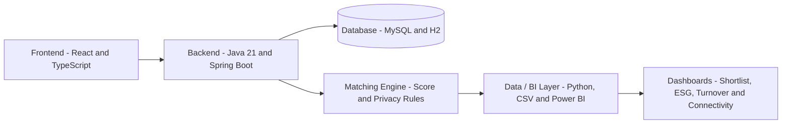

# App BiT

App BiT helps companies create fairer, privacy-conscious and data-driven hiring shortlists by combining candidate matching, anonymized screening and business intelligence analysis.


[](docs/power-bi-dashboard-tela-2.md)
[](LICENSE)
[](https://github.com/No-Country-simulation/S06-26-AB-Equipe_23/actions/workflows/full-mvp-ci.yml)

## Overview

App BiT is an intelligent recruiting MVP designed to support objective, inclusive and privacy-first hiring decisions.

The platform generates candidate shortlists based on job requirements, calculates match scores, protects sensitive candidate information during the first screening stage and supports decision-making with regional connectivity analysis and BI indicators such as Turnover, ESG and Team Health.

## MVP Results

- 8 official demo candidates validated.
- Candidate shortlist generated with match score.
- Sensitive candidate data protected during first screening.
- Contact information released only after explicit approval.
- BI-ready datasets prepared for Power BI analysis.
- Backend, frontend and Data / BI layer integrated into main.
- Full MVP CI validated with Backend, Frontend and Data / BI jobs.
- MVP version published as v1.0.0-mvp.

## Product Preview

The BI preview below uses the demonstrative company metrics dataset prepared for the MVP. It represents the dashboard structure for Turnover, ESG and Team Health analysis and is not a live embedded Power BI report.


Related BI assets:

- `data/powerbi/shortlist_candidatos_powerbi.csv`
- `data/powerbi/insights_regioes_powerbi.csv`
- `data/powerbi/metricas_empresa_demo.csv`
- `exports/mock_dashboard_metricas_empresa.html`

## Key Features

- Candidate matching based on job requirements and profile attributes.
- Privacy-first screening with anonymized candidate data.
- Sensitive contact release only after explicit approval.
- Bias-aware shortlist flow to reduce exposure of unnecessary personal data.
- Regional connectivity insights to support inclusive hiring decisions.
- BI-ready datasets for Power BI dashboards.
- Turnover, ESG and Team Health indicators for business analysis.
- Validation scripts to keep score, shortlist and BI outputs consistent.

## Architecture



Simplified flow:

```text
Frontend -> Backend API -> Matching and Privacy Rules -> Data / BI Outputs -> Dashboards
```

## Tech Stack

### Backend

- Java 21
- Spring Boot
- Maven
- Flyway
- H2
- MySQL
- JWT

### Frontend

- React
- TypeScript
- Vite
- Axios

### Data / BI

- Python
- Power BI
- DAX
- CSV
- Pytest

## Project Structure

```text
backend/      Backend API, business rules, authentication and migrations
frontend/     Web interface and backend integration
data/         Processed datasets for BI and dashboards
docs/         Technical and analytical documentation
scripts/      Data generation, validation and integration scripts
tests/        Score, anonymization and regression tests
```

## How to Run

### Backend

Requirements:

- Java 21
- Maven Wrapper
- MySQL for local database execution

```bash
cd backend
./mvnw test
./mvnw spring-boot:run
```

On Windows:

```powershell
cd backend
.\mvnw.cmd test
.\mvnw.cmd spring-boot:run
```

### Frontend

Requirements:

- Node.js
- npm

```bash
cd frontend
npm install
npm run dev
```

Build:

```bash
npm run build
```

### Data / BI

Requirements:

- Python
- Pytest

```bash
python -m pytest tests/test_score_match.py tests/test_score_regression.py tests/test_anonymization.py -q
python scripts/valida_integracao_bi.py
```

Generate the MVP shortlist:

```bash
python -m scripts.gera_shortlist_mvp
```

## Environment Variables

```env
DB_HOST_APPBIT=localhost
DB_PORT_APPBIT=3306
DB_NAME_APPBIT=appbit
DB_USER_APPBIT=root
DB_PASSWORD_APPBIT=your_password
JWT_SECRET=your_secure_secret_key
JWT_EXPIRATION_MS=86400000
VITE_API_URL=http://localhost:8080
```

## Documentation

Additional project documentation is available in the docs/ directory, including:

- Match score calculation
- Power BI support
- Data storytelling
- BI validation
- Candidate anonymization flow
- Backend and frontend integration notes

## Team Project and Contributions

App BiT was developed as a team project during the No Country simulation program.

| Contributor | Focus | Contribution |
| --- | --- | --- |
| Pedro Paullo Azevedo | Data / BI and integration support | Structured BI-ready datasets, validated the 8-candidate shortlist, supported score_match validation, documented data storytelling, prepared dashboard assets and checked anonymization rules. |
| Alessandra Heiser | Project management | Organized delivery priorities, aligned requirements with the team and supported sprint coordination for the MVP presentation. |
| Andre Ribeiro | Data analysis | Audited the score_match logic, validated error scenarios, supported regression tests and documented how the matching algorithm behaves. |
| Julio Noronha | Backend development | Built and stabilized backend services, authentication, database integration, migrations and backend CI validation. |

See [AUTHORS.md](AUTHORS.md) for contributor details.

## Status

MVP - locally validated.

## Authors and Contributors

This project was developed by the App BiT team during the No Country simulation program.

See [AUTHORS.md](AUTHORS.md) for contributor details.

## License

This project is licensed under the MIT License.

See [LICENSE](LICENSE) for details.
